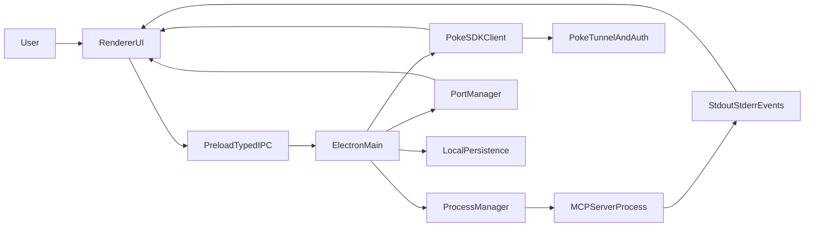

# MCPoke Desktop Manager Plan

## Architecture
- Use an Electron multi-process architecture with strict separation:
  - **Main process**: OS/process orchestration (install, spawn, stop, port probing, tunnel), secure credential/session handling, filesystem persistence.
  - **Preload bridge**: typed IPC API surface for lifecycle and observability actions.
  - **Renderer (React + TS)**: dense utility-first operations dashboard.
- Suggested structure:
  - [electron/main.ts](electron/main.ts)
  - [electron/ipc/auth.ts](electron/ipc/auth.ts)
  - [electron/ipc/registry.ts](electron/ipc/registry.ts)
  - [electron/ipc/runtime.ts](electron/ipc/runtime.ts)
  - [electron/services/pokeClient.ts](electron/services/pokeClient.ts)
  - [electron/services/processManager.ts](electron/services/processManager.ts)
  - [electron/services/portManager.ts](electron/services/portManager.ts)
  - [electron/services/logStream.ts](electron/services/logStream.ts)
  - [electron/services/persistence.ts](electron/services/persistence.ts)
  - [src/app/layout/AppShell.tsx](src/app/layout/AppShell.tsx)
  - [src/features/registry/RegistryTable.tsx](src/features/registry/RegistryTable.tsx)
  - [src/features/inspector/ServerInspector.tsx](src/features/inspector/ServerInspector.tsx)
  - [src/features/logs/LogsPanel.tsx](src/features/logs/LogsPanel.tsx)
  - [src/features/command/CommandPalette.tsx](src/features/command/CommandPalette.tsx)
  - [src/state/serverStore.ts](src/state/serverStore.ts)
  - [src/types/mcp.ts](src/types/mcp.ts)

## Data Contracts
- Define core types in [src/types/mcp.ts](src/types/mcp.ts):
  - `AuthSessionState`: `unauthenticated | authenticated | expired`
  - `ServerSourceType`: `preset | custom`
  - `RuntimeState`: `idle | installing | installed | starting | running | tunneling | stopping | error`
  - `PortMode`: `manual | random | fixed`
  - `PortStatus`: `in_use | conflict | assigned | none`
  - `ServerRegistryItem` includes id/name/description/source/packageOrRepo/config/platformSupport/install+runtime+tunnel state/port/toolsCount/lastSync/lastError.
  - `LogEntry`: timestamp/level/source/message/stream.
- Keep state transitions explicit with a reducer-style state machine per server (prevent illegal transitions, e.g., tunnel before running).

## Core Backend Services (Electron Main)
- **Auth Service** ([electron/services/pokeClient.ts](electron/services/pokeClient.ts), [electron/ipc/auth.ts](electron/ipc/auth.ts))
  - Login/logout via Poke SDK.
  - Emit auth state updates to renderer; expose identity metadata.
  - Handle token expiry and re-auth prompts.
- **Registry Service** ([electron/ipc/registry.ts](electron/ipc/registry.ts), [electron/services/persistence.ts](electron/services/persistence.ts))
  - Merge preset registry (bundled JSON) + custom entries (local persisted store).
  - CRUD for custom servers; validate package/repo/config schema.
- **Lifecycle Service** ([electron/services/processManager.ts](electron/services/processManager.ts), [electron/ipc/runtime.ts](electron/ipc/runtime.ts))
  - Idempotent actions: install/start/tunnel/stop/restart.
  - Track PID, command, args, cwd, env, start time, exit reason.
  - Return structured operation results and progressive status events.
- **Port Service** ([electron/services/portManager.ts](electron/services/portManager.ts))
  - Validate manual ports, allocate random available ports, detect conflicts.
  - Preflight checks before start/tunnel; surface conflict with actionable resolution.
- **Logs + Tools Service** ([electron/services/logStream.ts](electron/services/logStream.ts), [electron/ipc/runtime.ts](electron/ipc/runtime.ts))
  - Stream stdout/stderr as structured log entries.
  - Store rolling in-memory buffer + optional persisted session logs.
  - Query server-exposed tools/capabilities (or inspect via MCP inspector-compatible probing).

## Renderer UX (Dense, Command-Centric)
- Build a one-screen operational shell in [src/app/layout/AppShell.tsx](src/app/layout/AppShell.tsx):
  - Left nav: Auth, Registry, Running, Logs, Settings.
  - Main pane: compact registry table as default.
  - Right inspector drawer: selected server details/actions/tools/log preview.
- Registry table ([src/features/registry/RegistryTable.tsx](src/features/registry/RegistryTable.tsx)):
  - Compact rows, sticky headers, sortable columns, quick inline edits.
  - Inline chips for auth/install/runtime/tunnel/error/port status.
  - Row action bar: Install, Start, Tunnel, Stop, Logs, Inspector, Edit.
- Command palette ([src/features/command/CommandPalette.tsx](src/features/command/CommandPalette.tsx)):
  - Global shortcut and fuzzy actions for all server operations.
  - Action guardrails and contextual shortcuts by selected row.
- Tools viewer ([src/features/inspector/ServerInspector.tsx](src/features/inspector/ServerInspector.tsx)):
  - Dev-console style sections: capabilities, tools list, schemas, connection state.
- Logs panel ([src/features/logs/LogsPanel.tsx](src/features/logs/LogsPanel.tsx)):
  - Tail mode, severity/source filters, search, copy line, download selection/session.

## Cross-Platform & Reliability
- Add OS-aware process and shell handling in main process:
  - Path normalization, spawn command wrappers per OS, environment merging.
  - Platform compatibility warnings at registry-row level.
- Add resilient transition handling:
  - Timeouts, retries (safe/idempotent only), cancellation tokens, explicit error states.
  - Always map and display: process status + port + tunnel URL + poke connection state.

## Phased Delivery
- **Phase 1: Foundation**
  - Electron + React scaffold, typed IPC, shared types, utility-first theme tokens.
- **Phase 2: Core Ops**
  - Poke auth, registry merge (preset/custom), install/start/stop/tunnel pipeline.
- **Phase 3: Observability**
  - Structured logs, live status stream, tools/capabilities inspector, error surfaces.
- **Phase 4: Power UX**
  - Dense table polish, command palette, inline edit/actions, keyboard-heavy flows.
- **Phase 5: Hardening**
  - Cross-platform edge cases, conflict handling, persistence migrations, smoke tests.

## Verification Strategy
- Unit tests for state transitions, port allocation/conflict logic, registry validation.
- Integration tests for lifecycle idempotency and auth/session transitions.
- Cross-platform smoke matrix (Windows/macOS/Linux) for install/start/tunnel/stop path.
- UX acceptance checks: time-to-first-action, one-screen completion flows, keyboard parity.
