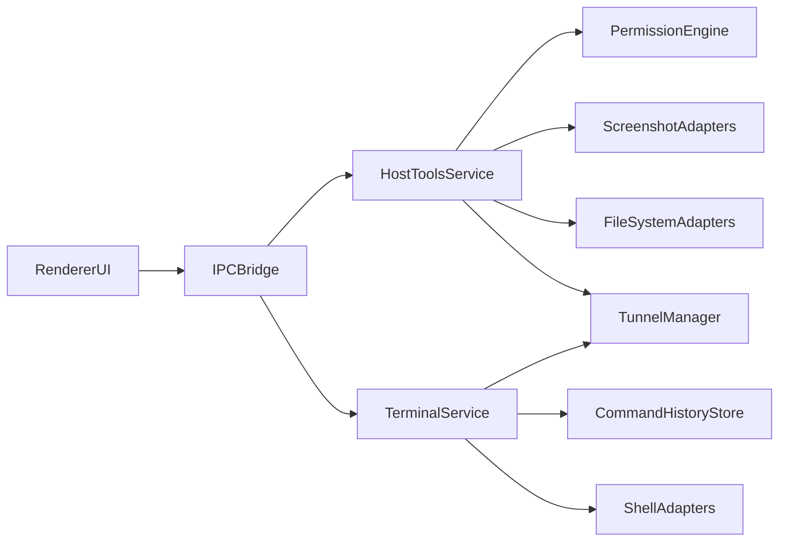

# Build Native `poke-pc` + `poke-gate` Parity in MCPoke

## Feasibility Verdict

This is feasible in `MCPoke` across Windows, macOS, and Linux because the app already has:
- Electron + Node runtime with platform-aware logic in [`C:/.projects/poke/MCPoke/src/main/services/runtimeCoordinator.ts`](C:/.projects/poke/MCPoke/src/main/services/runtimeCoordinator.ts)
- Existing Poke auth/tunnel integration patterns in [`C:/.projects/poke/MCPoke/src/main/services/authService.ts`](C:/.projects/poke/MCPoke/src/main/services/authService.ts)
- Tool and server orchestration via IPC + runtime coordinator

Main risk is not feasibility, but safely reproducing `poke-gate` high-privilege tools and `poke-pc` persistent terminal behavior without Docker.

## What to Build (Target Parity)

### `poke-gate` parity (native host)
- MCP tools: `run_command`, `read_file`, `write_file`, `list_directory`, `system_info`, `read_image`, `take_screenshot`
- Permission modes: `full`, `limited`, `sandbox-like`
- Approval flow for risky operations and session-level remember behavior
- Tunnel lifecycle with reconnect + tools sync + verbose logs

### `poke-pc` parity (native host)
- Persistent terminal sessions with command history + command status capture
- Bootstrap commands and startup ordering
- Optional webhook notifications for command completion/heartbeat
- File read restrictions for credentials paths and secret redaction in logs

## Technical Approach

## File-Level Implementation Plan

1. Add host tools execution layer in main process.
- Create `HostToolsService` for native implementations of command/file/system/image/screenshot tools.
- Wire tool registration and invocation through existing runtime coordinator and tool surfacing paths in [`C:/.projects/poke/MCPoke/src/main/services/runtimeCoordinator.ts`](C:/.projects/poke/MCPoke/src/main/services/runtimeCoordinator.ts).

2. Add permission engine matching `poke-gate` behavior.
- Create reusable policy engine (`full`/`limited`/`sandbox-like`) with allowlists and risky-operation approval tokens.
- Reuse existing IPC/eventing conventions via [`C:/.projects/poke/MCPoke/shared/ipc.ts`](C:/.projects/poke/MCPoke/shared/ipc.ts).

3. Add persistent terminal subsystem matching `poke-pc` behavior.
- Implement session manager with create/list/run/status/capture/kill semantics.
- Persist command history NDJSON-like logs into MCPoke state storage using patterns from [`C:/.projects/poke/MCPoke/src/main/services/persistence.ts`](C:/.projects/poke/MCPoke/src/main/services/persistence.ts).
- Replace tmux dependency with Node child-process session abstraction that works on all OSes.

4. Add cross-platform OS adapters.
- Shell adapter:
  - Windows: PowerShell/cmd invocation rules
  - macOS/Linux: shell invocation + cwd/env handling
- Screenshot adapter:
  - macOS: `screencapture`
  - Windows: PowerShell-based capture
  - Linux: `grim`/`gnome-screenshot` fallback strategy with capability detection
- Sandbox-like mode:
  - Implement MCPoke-level policy sandbox first (path/tool/command constraints) for all OSes.
  - Add optional OS-native hard sandbox integrations per platform where available.

5. Extend UI for parity controls + observability.
- Add settings for permission mode, startup behavior, webhook notifications, and log verbosity in [`C:/.projects/poke/MCPoke/src/features/settings/SettingsPanel.tsx`](C:/.projects/poke/MCPoke/src/features/settings/SettingsPanel.tsx).
- Add real-time command and tool logs panels (reuse [`C:/.projects/poke/MCPoke/src/features/logs/LogsPanel.tsx`](C:/.projects/poke/MCPoke/src/features/logs/LogsPanel.tsx)).

6. Security + hardening pass.
- Block credential directories by default (`~/.config/poke`, platform equivalents) in file-read tools.
- Add secret redaction for logs and webhook payloads.
- Add explicit high-risk command confirmation UX for destructive operations.

7. Cross-platform packaging and release.
- Add installer targets for Windows/macOS/Linux and artifact CI.
- Document platform caveats and permissions setup in [`C:/.projects/poke/MCPoke/README.md`](C:/.projects/poke/MCPoke/README.md).

8. Verification matrix.
- Unit tests for permission policy, command guardrails, and terminal state machine.
- Integration tests for each MCP tool contract.
- Manual smoke matrix for Win/macOS/Linux covering auth, tunnel, command exec, screenshot, and persistence.

## Milestones

- Milestone 1: Core host tools + permission engine + tunnel integration
- Milestone 2: Persistent terminal parity + command history + notifications
- Milestone 3: Cross-platform screenshot/file/command adapters + packaging
- Milestone 4: Security hardening + full QA matrix + release docs

## Known Gaps vs upstream packages to handle explicitly

- `poke-pc` uses Docker+tmux isolation; strict native mode requires equivalent safety via policy + optional constrained execution rather than container boundary.
- `poke-gate` sandbox mode relies on macOS `sandbox-exec`; cross-platform parity needs a normalized MCPoke policy sandbox that behaves consistently on all OSes.